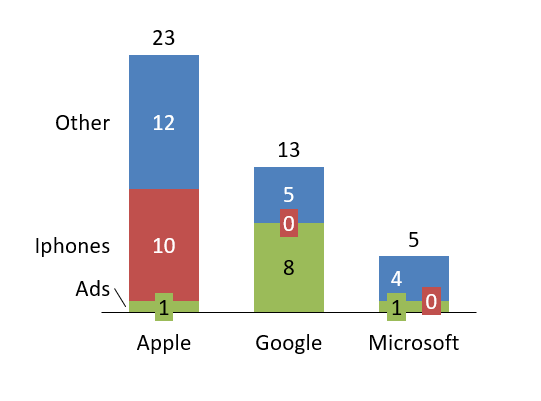

# thinkcell 
thinkcell is a simple library that helps you automatically generate presentations in an quick and simple way. 

In order to use it you will need a valid and working [think-cell license and installation](https://www.think-cell.com/en/). 

### Installation

thinkcell is available on PyPi. 

```console
 $ pip install thinkcell
 ```

### Tutorial and Usage

Let us say you have generated a template `template.pptx` according to [think-cell's automation guidelines](https://www.think-cell.com/en/support/manual/jsondataautomation.shtml) with the following chart named `Chart1`: 

<center>

</center>

The thinkcell library helps you generate a `.pptc` file so that you can generate other graphs based on that template:

```python
from thinkcell import Thinkcell

template_name = "simple-template.pptx"
categories = ["Ads", "iPhones", "Other"]
chart_name = "Chart1"
filename = "simple-example.ppttc"

data = [["Apple", 1, 11, 14], ["Google", 8, 2, 15], ["Microsoft", 1, 2, 12]]

tc = Thinkcell()
tc.add_template(template_name)
tc.add_chart(
    template_name=template_name,
    chart_name=chart_name,
    categories=categories,
    data=data,
)

tc.save_ppttc(filename=filename)
 ```

Once done, go ahead and double click the `simple-example.pptc` file, and your chart will be generated.

Visit the [examples folder](examples) for more examples and source files. 

### Contributing

Start by forking this repo.


Install the development dependencies (you probably want to do this in a [virtual environment](https://docs.python-guide.org/dev/virtualenvs/)):

```console
 $ pip install -r requirements-dev.txt
 ```

Make sure the tests run:

```console
 $ pytest
 ```

Then you can create a branch and submit a pull request. 


### Progress and Todos

To do:
- [x] Make complex examples
- [x] Finish readme
- [ ] Continuous integration
- [ ] Pypi